# Installing Cloud Pak for Integration
The IBM Cloud Pak for Integration (CP4I) is delivered as operators that are installed and managed using the Operator Lifecycle Manager (OLM) within Red Hat OpenShift. To install CP4I, we will verify that the OLM Catalog Sources for IBM components have been added, we will then install the operators using OLM, create the CP4I custom resource, and finally deploy some of the capabilities and runtimes.

### Environment
- Bluedemos Template: https://bluedemos.com/show/3916
- Desktop Login: ibmuser/engageibm
- OpenShift Console URL: https://console-openshift-console.apps.demo.ibmdte.net/
- OpenShift Credentials: ibmadmin/engageibm [auth: htpasswd]

### OLM Catalog Sources
1. From your web browser use the  icon to open the OpenShift console.

   <ins>Warning</ins> If you get a `PR_END_OF_FILE_ERROR` error in the browser it is most likely indicative of an OpenShift certificate expiration issue. To fix the problem follow the steps in **Appendix A** below and then come back to this section.

2. The login credentials should already be saved in the browser. If not use `ibmadmin` as Username and `engageibm` as Password (make sure to select the `htpasswd` authentication method).
3. From the left hand menu expand `Operators > OperatorHub` and search for `cloud pak`. If the result is similar to the screenshot below skip Step 4 below and move to the next section.

   

4. (Optional) Click on the  sign in the top right hand corner and paste the code from  in the yaml editor and click `Create`. Repeat with . Within a few minutes there should be two new pods in the `openshift-marketplace` project.

   

### Install the CP4I Operators
You can install all of the CP4I operators at once by using the Cloud Pak for Integration operator, or install a subset of operators by selecting and installing only the operators you want to use on your cluster. When installing an operator, OLM will automatically install any required dependencies.

1. If you are not within the `OperatorHub` menu of the OpenShift console follow the instructions in Step 3 from the previous section and select the `IBM Cloud Pak for Integration` tile.

   
   
2. Read the description of the CP4I operator and click `Install`.

   
   
3. Accept all the defaults to install the operator at the cluster level. Click `Subscribe`.

   

   The OLM will now go out and pull all the operators included in CP4I and their dependencies from the online catalog and install them. This could take several minutes. When complete the result should look something like the following with `Succeeded` as status:
   
   
   
   <ins>Warning</ins> If the `IBM Operator for Redis` operator remains indefinitely in an `Installing` state you can simply ignore the message. This will only affect the deployment of the `Aspera` capability. However, if you really want to fix the problem refer to **Appendix B**.  
   
### Create an instance of the Platform Navigator
We will deploy the Platform Navigator (PN) inside of a pre-configured namespace. We will use an online installation method to pull the necessary images from the `IBM Entitled Registry` using a pre-defined `entitlement key`.

1. From the OpenShift console, navigate to `Operators > Installed Operators`. Use the dropdown menu to select the `cp4i` project and select `IBM Cloud Pak for Integration Platform Navigator` from the list of installed operators.

   

2. From the `Details` tab click on `Create Instance`.

   
   
3. Verify that the namespace is `cp4i` and change the accept field to `true` within the yaml editor. Click `Create`

   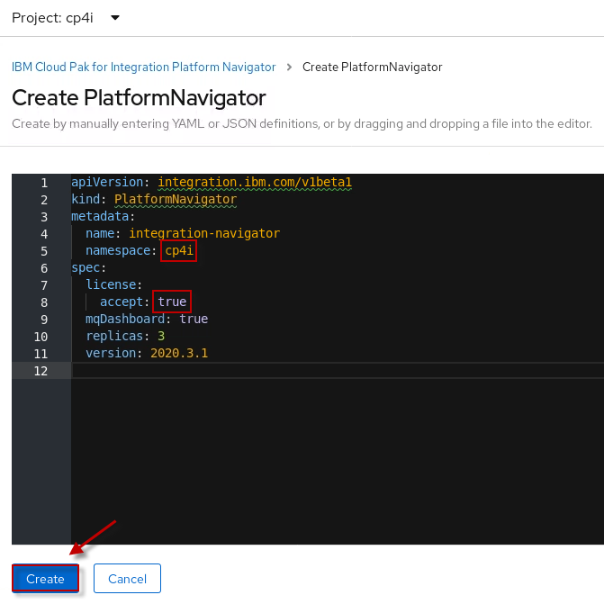
   
4. The deployment may take several minutes as the required images are downloaded from the image registry and any dependent services are deployed. If everything goes well the `Status` will change to `Ready`:

   
   
5. Once deployed, you can find the PN endpoint by clicking on its `Name` as shown below: 

   
   
6. To open up the PN click on its URL under `Platform Navigator UI`:

   
   
7. The password for the `admin` user is stored in a secret called `platform-auth-idp-credentials` in the `ibm-common-services` namespace. To decode its value open a Terminal from the desktop and enter the following command:

   ```sh
   oc get secrets -n ibm-common-services platform-auth-idp-credentials -o jsonpath='{.data.admin_password}' | base64 --decode && echo ""
   ```
   If you are prompted for a login and password after entering the above `oc` command use `ibmadmin` and `engageibm`.
   
8. Login to the Platform Navigator UI using `admin` as username and the password derived in Step 7 above. You are now ready to deploy some of the platform capabilities.
   
      

### Deploy Platform Capabilities and Runtimes
You will now use the PN to deploy further integration capabilities. Capabilities provide tools for designing and managing integration instances like App Connect Dasboard, App Connect Designer, API Connect, Operations Dashboard or Asset Repository. Runtimes and instances are the runtime components of your integration solution like Aspera High speed transfer server, DataPower Gateway, Event Streams Kafka cluster or MQ Queue manager.

#### App Connect Designer

   1. From the Platform Navigator UI home screen, click on `Create capability`.
      
      
      
   2. Select the `App Connect Designer` tile and click `Next`.

      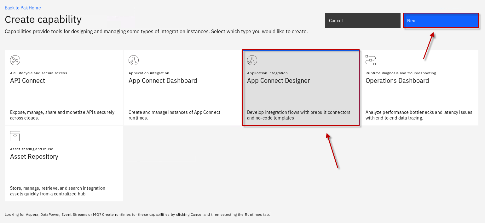
      
   3. From the list of options, select `Quick start` and click `Next`.

      
      
   4. On the configuration page, use the values from the following table to populate the fields, keeping the default for the remaining ones and click `Create`.

      | Field                                     |               Value |
      | :---                                      |                ---: |
      | Namespace                                 |                 ace |
      | Storage class (optional)                  | managed-nfs-storage |
      | Size                                      |                  10 |
      | Enable Designer Mapping Assist (optional) |                  On |
      | Accept Terms and Conditions               |                  On | 

      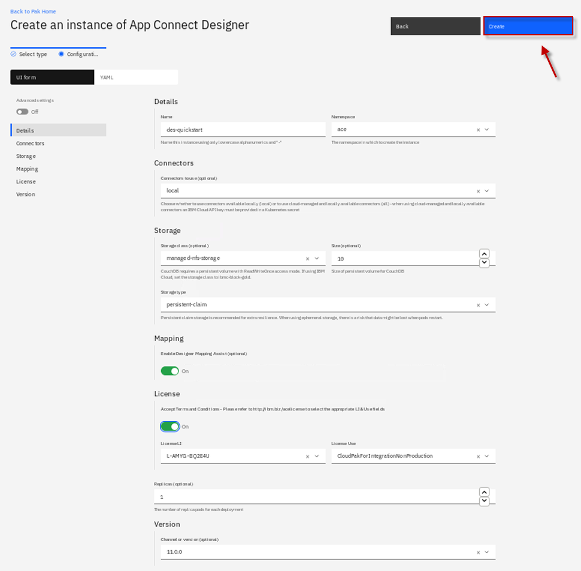
      
      After a few minutes the capability should be deployed and be ready to use. If not check the logs and events within the OpenShift console or use the `oc describe` and `oc logs` commands on the failing pods within the given namespace.
   
      
      
#### App Connect Dashboard

   1. From the Platform Navigator UI home screen, click on `Create capability` just like in the previous section.
      
   2. Select the `App Connect Dashboard` tile and click `Next`.

      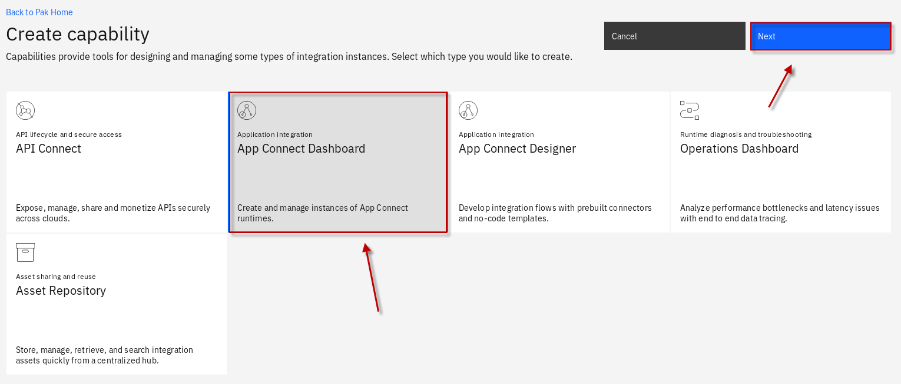
      
   3. From the list of options, select `Quick start` and click `Next`.

      
      
   4. On the configuration page, use the values from the following table to populate the fields, keeping the default for the remaining ones and click `Create`.

      | Field                                     |               Value |
      | :---                                      |                ---: |
      | Namespace                                 |                 ace |
      | Accept Terms and Conditions               |                  On | 
      | persistent-claim storage class (optional) | managed-nfs-storage |

      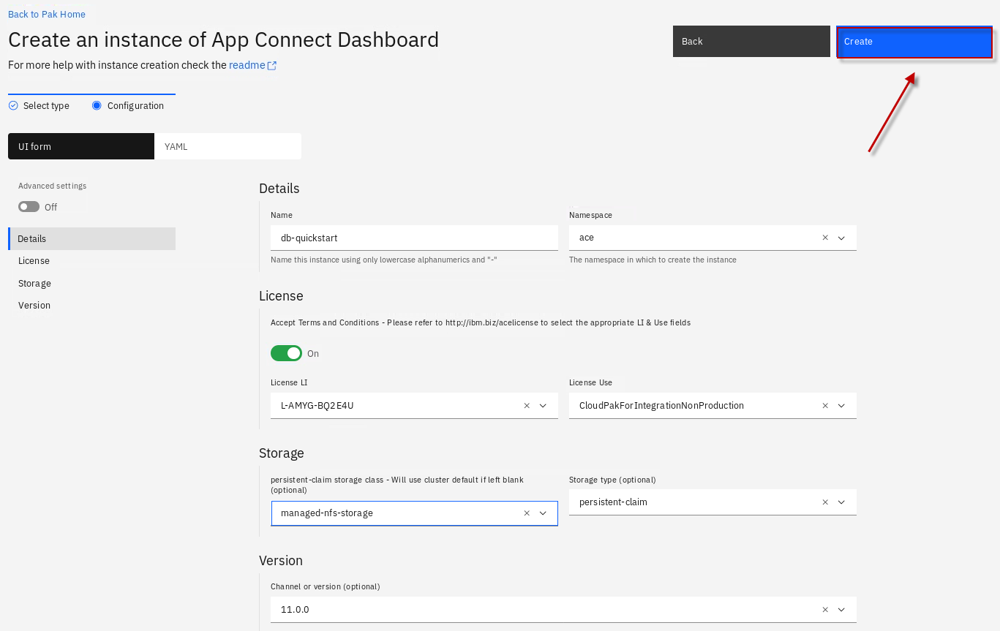
      
      After a few minutes the capability should be deployed and be ready to use. If not check the logs and events within the OpenShift console or use the `oc describe` and `oc logs` commands on the failing pods within the given namespace.
   
      

#### Operations Dashboard

   1. From the Platform Navigator UI home screen, click on `Create capability` just like in the previous section.
      
   2. Select the `Operations Dashboard` tile and click `Next`.

      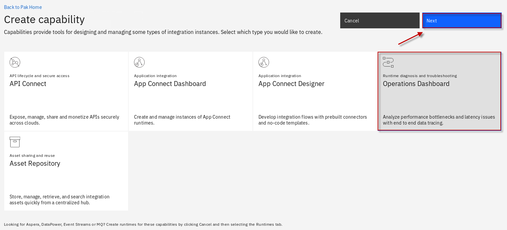
      
   3. From the list of options, select `example-operationsdashboard` and click `Next`.

      
      
   4. On the configuration page, use the values from the following table to populate the fields, keeping the default for the remaining ones and click `Create`.

      | Field                                     |               Value |
      | :---                                      |                ---: |
      | Name                                      |                  od |
      | Namespace                                 |             tracing | 
      | Config DB storage class name              | managed-nfs-storage |
      | Store storage class name                  | managed-nfs-storage |

      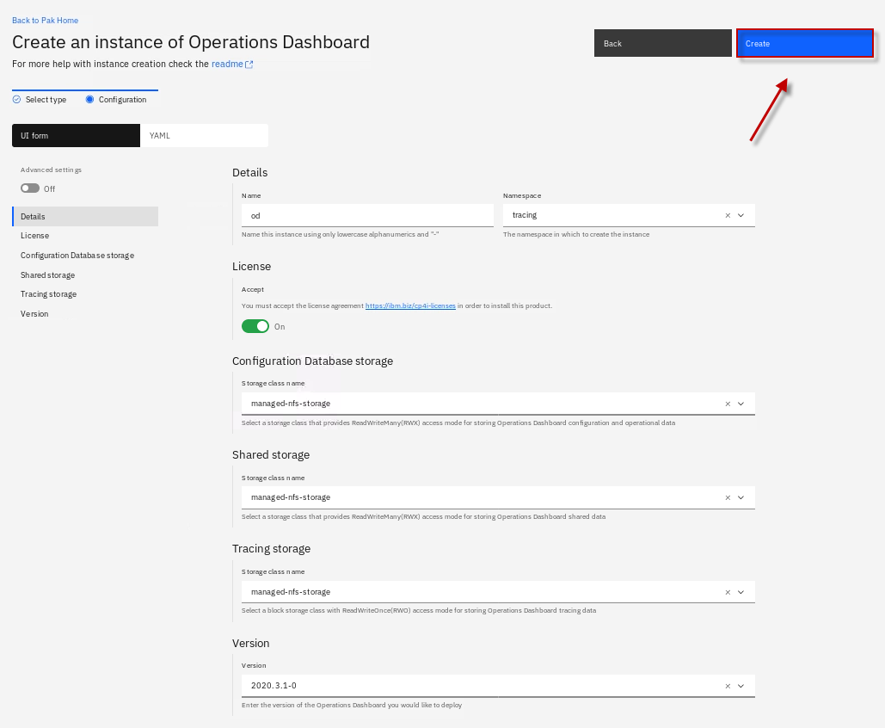
      
      After a few minutes the capability should be deployed and be ready to use. If not check the logs and events within the OpenShift console or use the `oc describe` and `oc logs` commands on the failing pods within the given namespace.
   
      

#### Asset Repository

   1. From the Platform Navigator UI home screen, click on `Create capability` just like in the previous section.
      
   2. Select the `Asset Repository` tile and click `Next`.

      
      
   3. From the list of options, select `Development` and click `Next`.

      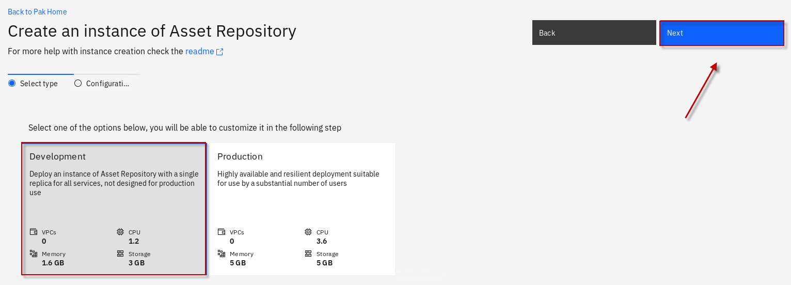
      
   4. On the configuration page, use the values from the following table to populate the fields, keeping the default for the remaining ones and click `Create`.

      | Field                                     |               Value |
      | :---                                      |                ---: |
      | Name                                      |       assetrepo-dev |
      | Namespace                                 |           assetrepo | 
      | License agreement                         |                  On |
      | Asset data storage class                  | managed-nfs-storage |
      | Asset metadata storage class              | managed-nfs-storage |

      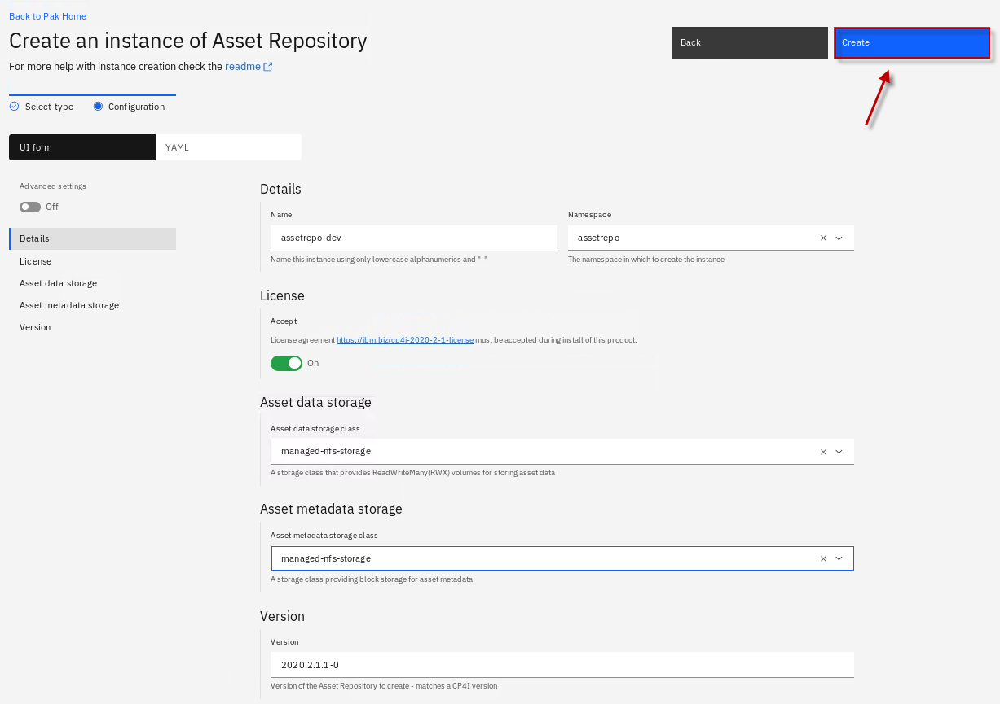
      
      After a few minutes the capability should be deployed and be ready to use. If not check the logs and events within the OpenShift console or use the `oc describe` and `oc logs` commands on the failing pods within the given namespace.
   
      

#### Queue Manager

   1. From the Platform Navigator UI home screen, click on the `Runtimes` tab and then `Create instance`.
      
      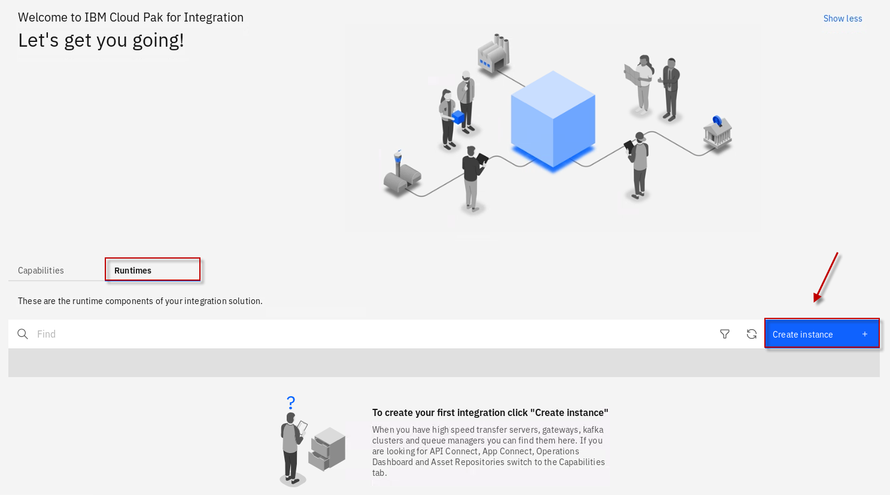
      
   2. Select the `Queue manager` tile and click `Next`.

      
      
   3. From the list of options, select `Quick start` and click `Next`.

      
      
   4. On the configuration page, use the values from the following table to populate the fields, keeping the default for the remaining ones and click `Create`.

      | Field                                     |                Value |
      | :---                                      |                 ---: |
      | Name                                      |        qm-quickstart |
      | Namespace                                 |                   mq |
      | License acceptance                        |                   On |
      | License metric (optional)                 | VirtualProcessorCore |
      | Type of availability (optional)           |       SingleInstance |
      | Enable Tracing                            |                   On |
      | Tracing Namespace                         |              tracing |
 
      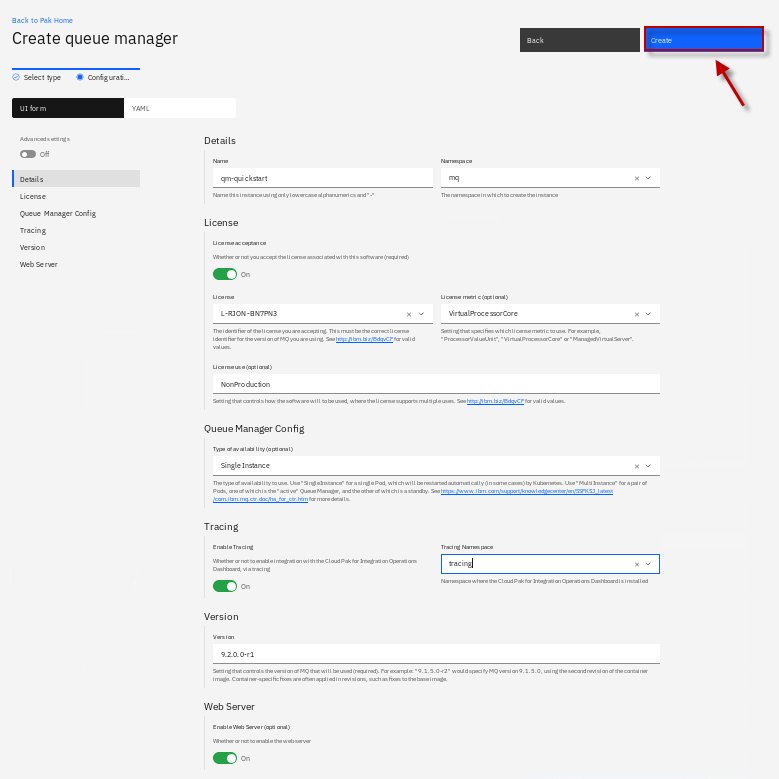
      
   5. Since we've enabled tracing on the QM instance, the runtime will remain in `Pending` state until we approve the registration request in the `Operations Dashboard`. Switch to the OpenShift console, navigate to `Workloads > Pods` and select `Project: mq`. You will notice the QM pod in a `CreateContainerConfigError` state.
      
      
      
   6. In order to resolve this problem go back to Platform Navigator UI and click on the deployed `od` capability. 
   
      
      
   7. From there navigate to `Manage > Registration requests` and click on `Approve`
   
      
      
   8. Within the new `Request approval` pop-up click on the `Copy to clipboard` icon
   
      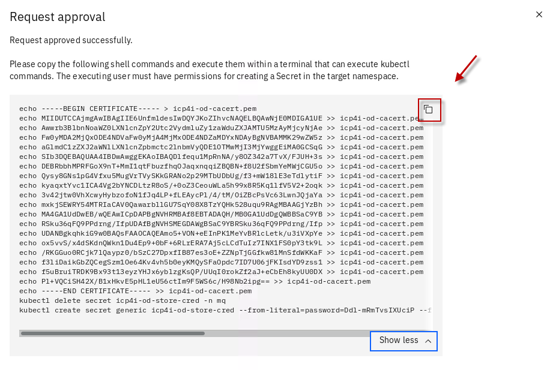
      
   9. Switch back to your `Terminal` and paste the commands you copied from above
   
      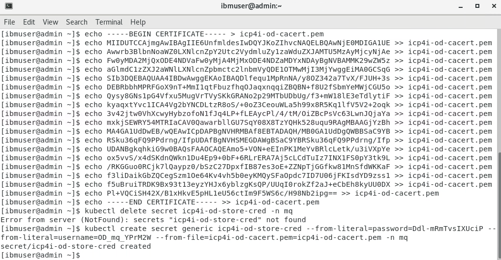
   
   10. After a few minutes, the QM pod will be in `Running` state and the runtime `Ready`
   
         
   
       

#### Event Streams

   1. From the Platform Navigator UI home screen, click on `Create instance` just like in the previous section.
      
   2. Select the `Kafka cluster` tile and click `Next`.

      
      
   3. From the list of options, select `Development` and click `Next`.

      
      
   4. On the configuration page, use the values from the following table to populate the fields, keeping the default for the remaining ones and click `Create`.

      | Field                                     |                                                Value |
      | :---                                      |                                                 ---: |
      | Name                                      |                                               es-dev |
      | Namespace                                 |                                         eventstreams | 
      | License accept                            |                                                   On |
      | Storage type                              |                                     persistent-claim |
      | Storage size (optional)                   | 10Gi (Kafka and Zookeeper) and 2Gi (Schema Registry) |
      | Storage class (optional)                  |                                  managed-nfs-storage |

      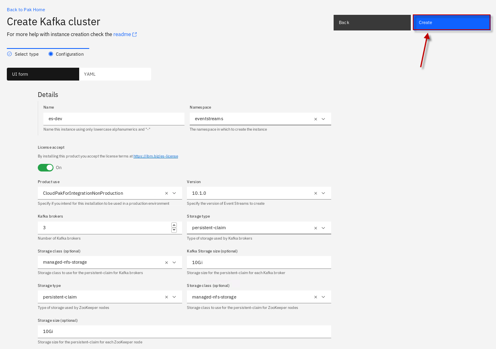
      
   7. After a few minutes the runtime should be deployed and be ready to use. If not check the logs and events within the OpenShift console or use the `oc describe` and `oc logs` commands on the failing pods within the given namespace.
      
      

#### API Connect

   1. From the Platform Navigator UI home screen, click on the `Capabilities` tab and then `Create capability`.
      
   2. Select the `API Connect` tile and click `Next`.

      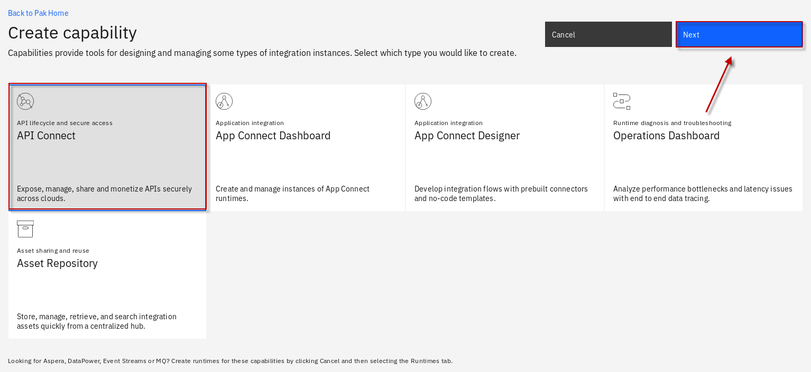
      
   3. From the list of options, select `One Node - Minimum` and click `Next`.

      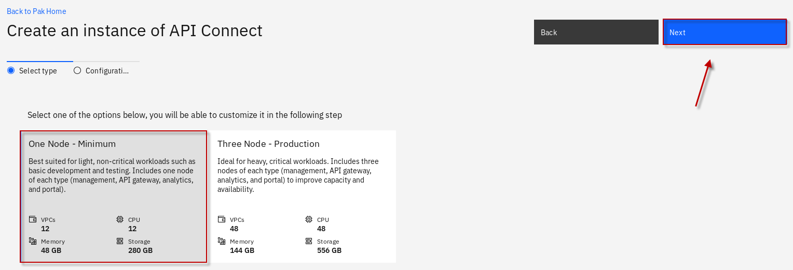
      
   4. On the configuration page, use the values from the following table to populate the fields, keeping the default for the remaining ones and click `Create`.

      | Field                                     |               Value |
      | :---                                      |                ---: |
      | Name                                      |            apic-min |
      | Namespace                                 |                apic | 
      | License acceptance                        |                  On |

      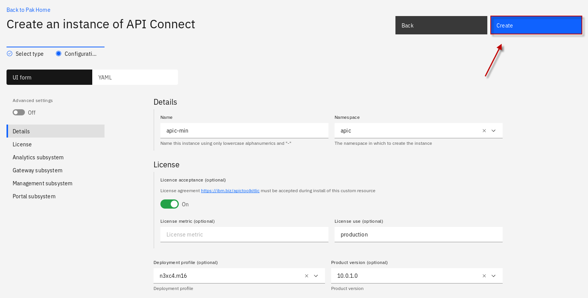
      
      After several minutes the capability should be deployed and be ready to use. If not check the logs and events within the OpenShift console or use the `oc describe` and `oc logs` commands on the failing pods within the given namespace.
   
      
      
### Appendix A

1. From your desktop open a `Terminal` window and issue the following commands:

   ```sh
   [ibmuser@admin ~]$ ssh root@dns
   root@dns's password: passw0rd
   
   [root@dns ~]# oc get nodes
   NAME      STATUS     ROLES           AGE   VERSION
   master1   NotReady   master,worker   96d   v1.17.1+6af3663
   master2   NotReady   master,worker   96d   v1.17.1+6af3663
   master3   NotReady   master,worker   96d   v1.17.1+6af3663
   worker1   NotReady   worker          96d   v1.17.1+6af3663
   worker2   NotReady   worker          96d   v1.17.1+6af3663
   worker3   NotReady   worker          96d   v1.17.1+6af3663
   worker4   NotReady   worker          96d   v1.17.1+6af3663
   
   [root@dns ~]# oc get csr -o name | xargs oc adm certificate approve
   certificatesigningrequest.certificates.k8s.io/csr-4bt7c approved
   certificatesigningrequest.certificates.k8s.io/csr-4lngv approved
   ...
   certificatesigningrequest.certificates.k8s.io/csr-vwgkf approved
   
   [root@dns ~]# oc get nodes
   NAME      STATUS   ROLES           AGE   VERSION
   master1   Ready    master,worker   96d   v1.17.1+6af3663
   master2   Ready    master,worker   96d   v1.17.1+6af3663
   master3   Ready    master,worker   96d   v1.17.1+6af3663
   worker1   Ready    worker          96d   v1.17.1+6af3663
   worker2   Ready    worker          96d   v1.17.1+6af3663
   worker3   Ready    worker          96d   v1.17.1+6af3663
   worker4   Ready    worker          96d   v1.17.1+6af3663
   
   [root@dns ~]# exit
   ```

### Appendix B

1. The `IBM Operator for Redis` operator may fail to install because of a memory resource constraint. If you see something like the following in the list of installed operators:

   
   
2. Navigate to `Workloads > Pods` and select `Project: openshift-operators` from the dropdown. Look for a pod that is crashing with an `OOMKilled` or `CrashLoopBackOff` error.

   

3. Look for the corresponding deployment under `Workloads > Deployments` and use the `Edit Deployment` option to modify it.

   

4. In the YAML editor scroll down to the `resources` section to update the `memory` requests and limits to `256Mi`. Click `Save`.

   

5. This will spawn a new pod and the operator installation will eventually change to `Succeeded`.

   

