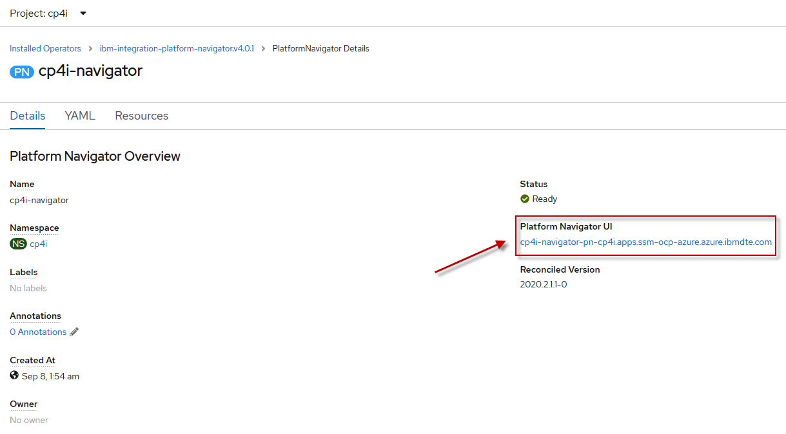

# Installing Cloud Pak for Integration
The IBM Cloud Pak for Integration (CP4I) is delivered as operators that are installed and managed using the Operator Lifecycle Manager (OLM) within Red Hat OpenShift. To install CP4I, we will verify that the OLM Catalog Sources for IBM components have been added, we will then install the operators using OLM, create the CP4I custom resource, and finally deploy some of the capabilities and runtimes.

### OLM Catalog Sources
1. From your web browser use the bookmark tab to open the OpenShift console.
2. The login credentials should already be saved in the browser. If not use `ibmuser` as Username and `engageibm` as Password.
3. From the left hand menu expand `Operators > OperatorHub` and search for `cloud pak`. If the result is similar to the screenshot below skip Step 4 below.

   

4. (Optional) Click on the  sign in the top right hand corner and paste the code from  in the yaml editor and click `Create`. Repeat with . Within a few minutes there should be two new pods in the `openshift-marketplace` project.

   

### Install the CP4I Operators
You can install all of the CP4I operators at once by using the Cloud Pak for Integration operator, or install a subset of operators by selecting and installing only the operators you want to use on your cluster. When installing an operator, OLM will automatically install any required dependencies.

5. If you are not within the `OperatorHub` menu of the OpenShift console follow the instructions in Step 3 above and select the `IBM Cloud Pak for Integration` tile.

   
   
6. Read the description of the CP4I operator and click `Install`.

   
   
7. Accept all the defaults to install the operator at the cluster level. Click `Subscribe`.

   

   The OLM will now go out and pull all the operators included in CP4I and their dependencies from the online catalog and install them. This could take several minutes. When complete the result should look something like the following with `Succeeded` as status:
   
   
   
### Create an instance of the Platform Navigator
We will deploy the Platform Navigator (PN) inside of a pre-configured namespace. We will use an online installation method to pull the necessary images from the `IBM Entitled Registry` using a pre-defined `entitlement key`.

1. From the OpenShift console, navigate to `Operators > Installed Operators`. Use the dropdown menu to select the `cp4i` project and select `IBM Cloud Pak for Integration Platform Navigator` from the list of installed operators.

   

2. From the `Details` tab click on `Create Instance`.

   
   
3. Verify that the namespace is `cp4i` and change the accept field to `true` within the yaml editor. Click `Create`

   
   
4. The deployment may take several minutes as the required images are downloaded from the image registry and any dependent services are deployed. If everything goes well the `Status` will change to `Ready`:

   
   
5. Once deployed, you can find the PN endpoint by clicking on its `Name` as shown below: 

   
   
6. To open up the PN click on its URL under `Platform Navigator UI`:

   
   
7. The password for the `admin` user is stored in a secret called `platform-auth-idp-credentials` in the `ibm-common-services` namespace. To decode its value open a Terminal from the desktop and enter the following command:

   ```sh
   oc get secrets -n ibm-common-services platform-auth-idp-credentials -o jsonpath='{.data.admin_password}' | base64 --decode && echo ""
   ```
   If you are prompted for a login and password after entering the above `oc` command use `ibmadmin` and `engageibm`.
   
8. Login to the Platform Navigator UI using `admin` as username and the password derived in Step 7 above. You are now ready to deploy some of the platform capabilities.
   
      

### Deploy Platform Capabilities and Runtimes
You will now use the PN to deploy further integration capabilities. Capabilities provide tools for designing and managing integration instances like App Connect Dasboard, App Connect Designer, API Connect, Operations Dashboard or Asset Repository. Runtimes and instances are the runtime components of your integration solution like Aspera High speed transfer server, DataPower Gateway, Event Streams Kafka cluster or MQ Queue manager.

#### 1. App Connect Designer

a. From the Platform Navigator UI home screen, click on `Create capability`

      
      
b. Select the `App Connect Designer` tile and click `Next`

      
      
c. From the list of options, select `Quick start` and click `Next`

      
      
d. On the configuration page, use the values from the following table to populate the fields, keeping the default for the remaining ones:

      | Field | Value |
      | ------ | ------ |
      | Name | des-quickstart |

      


